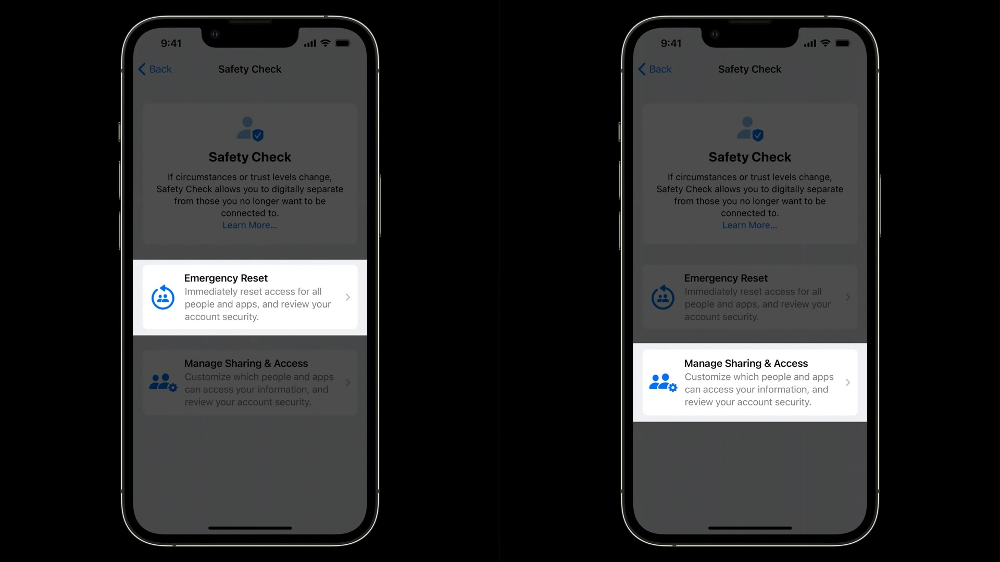
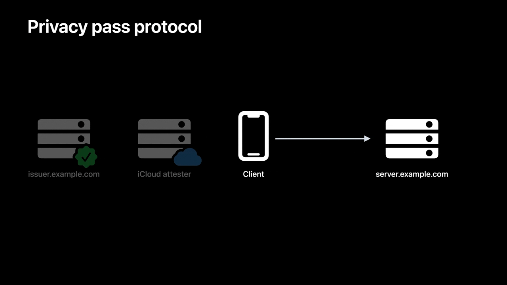
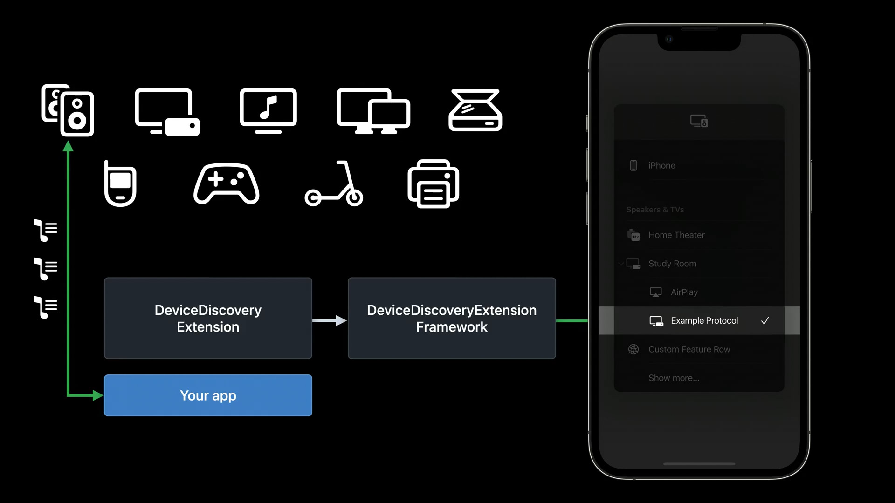
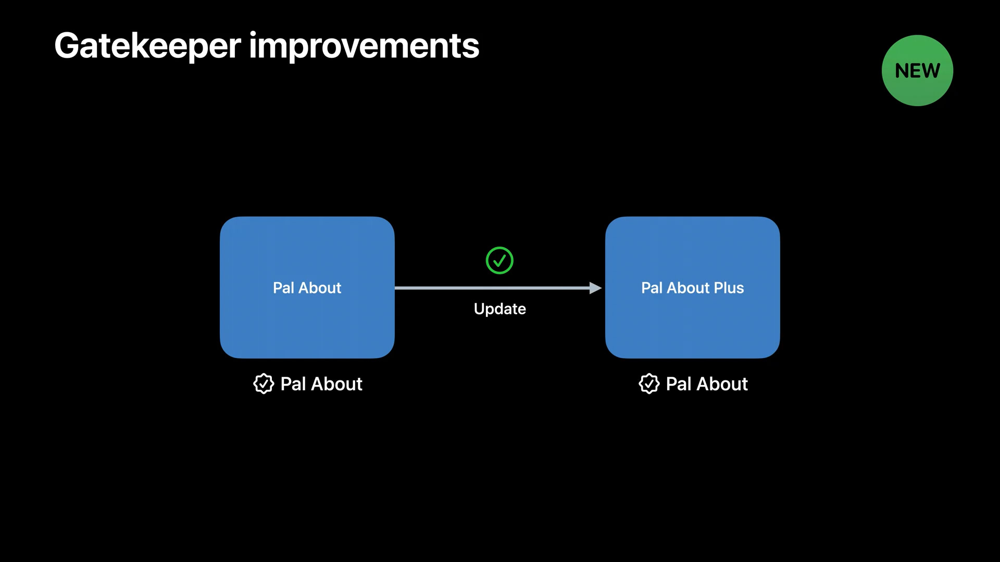
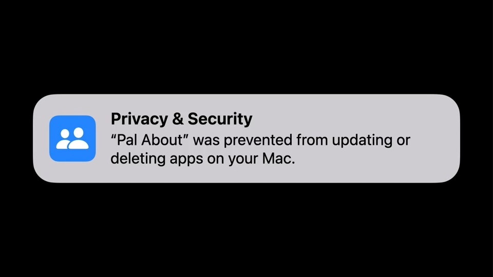
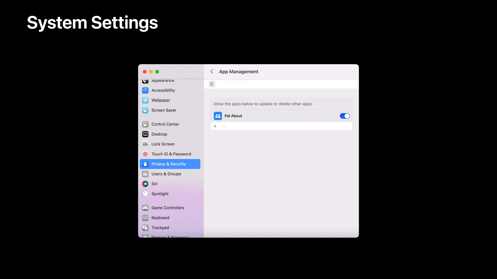
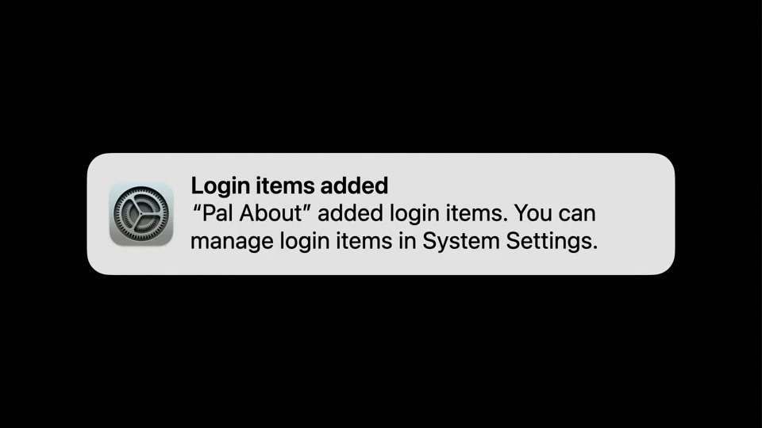
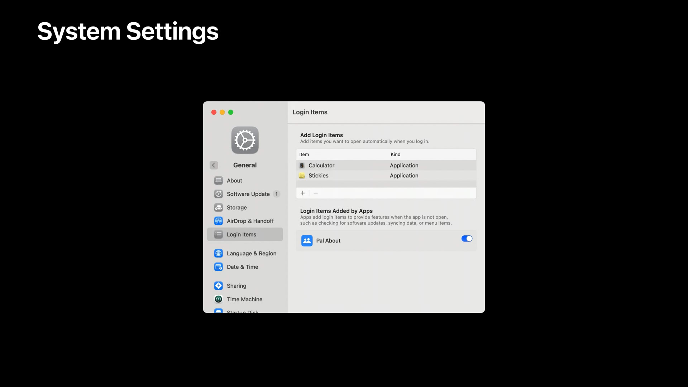
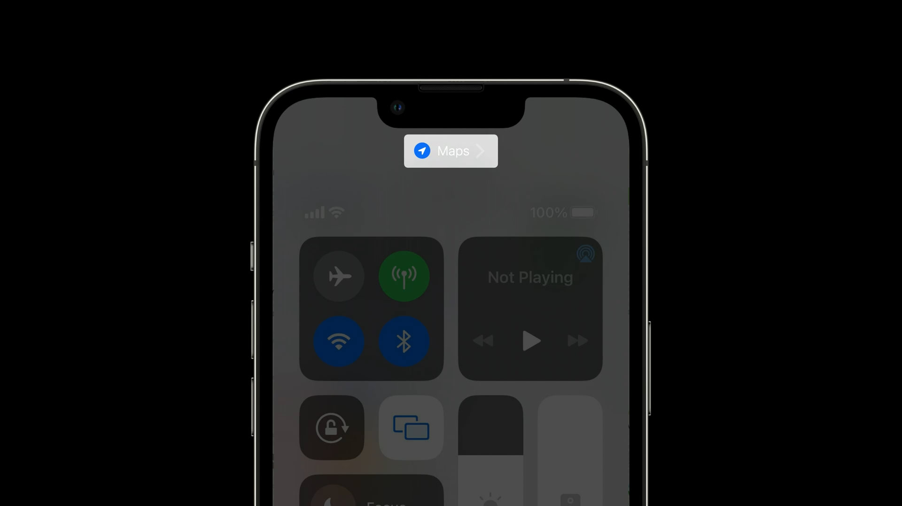
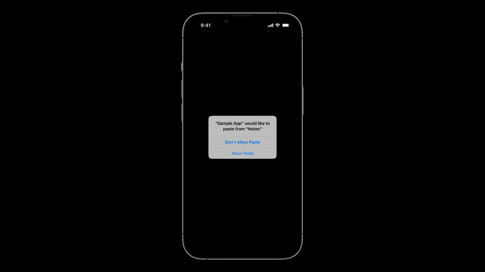

Apple kicked off its global annual developer conference, WWDC, with a ton of new features and technologies. As with previous years, Apple presented a number of new security and privacy features. While some of these features made their way into the main keynote, many more were left out. These features were instead detailed in the various developer sessions hosted throughout the week.

### Privacy Pillars

Apple set out a set of actionable patterns for both themselves and developers which serve as a guide on how to build privacy into an app or service.

- Data minimization
  - Use only the data needed to build the feature.
- On-device processing
  - If the feature requires sensitive data, use the power of the device to avoid sharing it with the server.
- Transparency and control
  - If sensitive data is sent off device, make sure people understand what is sent, how it's used, and give them control.
- Security protections
  - Protect sensitive data in transit and at rest, both on and off the device.

These pillars can be seen in each of the following new features:

### Passkeys

Passkeys are a solution to the shortcomings of password-based authentication.

Passkeys function fundamentally differently than passwords. Rather than having a single, typeable string, a passkey is actually a pair of related keys. These keys are generated by your devices, securely and uniquely, for every account. One is public and is stored on the server. The other is private and stays on your devices even when signing in. The public key is not a secret; it’s just as public as your username. The private key is what is needed to actually sign in. The server never learns what your private key is, as it is securely stored on-device.

When you go to sign in, the server sends your device a single-use challenge. WebAuthn, a core component of the FIDO2 Project, allows many different challenge-response algorithms, but passkeys on Apple platforms use standard ES256. Only your private key is capable of producing a valid solution to the challenge for your account. Your device produces this solution—called a signature—locally, and only sends the solution back to the server. Your private key stays secret and only on your devices. The server then validates the solution using your public key. If the solution your device provided is valid, you're signed in.

A public key can be used to check if a solution is valid but is not able to produce a solution itself. This means the server can be sure that you have the right private key, without knowing what the private key actually is. And since the server doesn't know any private keys, it's a less valuable target for attackers, because there are no user credentials to leak.

Password managers are good at generating unique, high-entropy strings, may have local protections against device theft, and offer some hints about phishing. Adding two factor authentication can help with theft or phishing but doesn't really solve either. With passkeys though, every passkey is a unique, device-generated key pair. Passkeys also completely eliminate the human factor from phishing. And they can't be leaked by an app or website server, because the servers don't have the private keys.

Apple's passkey implementation is built on open standards in conjunction with other platform vendors within the FIDO Alliance to make sure that passkey implementations are compatible cross-platform and can work on as many devices as possible.

### Safety Check

Safety Check is designed to help people in domestic or intimate partner violence situations review and reset access they may have granted to others previously.

Safety Check helps in the following ways: It stops sharing data with people by turning off location sharing in Find My and stopping sharing in Photos, Notes and Calendar. It stops sharing data with apps by resetting system privacy permission for all third-party apps. It helps you sign out of FaceTime and iMessage on your other iCloud devices to ensure Messages and calls are sent only to the device in your hand. It walks you through signing out of other iCloud devices to ensure other devices can't receive updates on location from Find My, Photos, calendars, etc. It helps you change passwords for both the device and iCloud account. And trusted phone numbers for iCloud two-factor auth. And it helps you manage emergency contacts to make any changes as needed. All these things together help people with threats to their personal safety control access to their data.

There are two ways to use Safety Check. The first is Emergency Reset, for crisis situations when you need to immediately reset access across people and apps.

The second is Manage Sharing & Access, which provides more fine-grained control over each capability of Safety Check.

Emergency Reset lets you quickly take action across all people and all apps and disables access to FaceTime and iMessage on your other devices. Then you are walked through securing your iCloud account to the device in your hand and reviewing your emergency contacts and trusted devices. Manage Sharing & Access lets you review person by person and app by app to review who you're sharing with. You can sort this by name or the type of information you're sharing. This is a great tool to understand and control your sharing with a particular person. It also can help you find an app with sensitive permissions installed by someone with access to your device.

Quick Exit is available in all Safety Check flows and quickly lets people exit the flow if they're concerned someone might see what they're doing. Pressing it returns them to the home screen, and the next time they enter settings, they'll be back on the main settings page, not in Safety Check.

### Private Access Tokens

Chances are, if you've signed up for a new account on a website, or tried to sign in with an existing account, you've encountered CAPTCHAs at some point. Sometimes, a CAPTCHA is just a button to press, but others can be a challenge to fill out. And while CAPTCHAs are typically implemented to prevent fraud, they often make it harder for legitimate visitors to access content.

CAPTCHAs can also pose a privacy risk. In order to determine if a client is trusted and can get an easier CAPTCHA, servers often rely on tracking or fingerprinting clients by using their IP address.

Private Access Tokens aim to tackle these challenges. Even when interacting with a website for the first time, or loading it through an app or browser, you’ve already performed many actions that are hard for a bot to imitate. First, you have a device, and you’ve unlocked that device. You’re likely signed in to the device with your Apple ID. And you’ve launched a code-signed app.

According to Apple, this information can help your servers trust legitimate clients and prevent fraud, without relying on CAPTCHAs, and without compromising privacy by tracking clients. Private Access Tokens are what allow servers to automatically trust clients without friction, new in iOS 16 and macOS Ventura.

Private Access Tokens works by using technology being standardized in the IETF Privacy Pass working group, coordinated by a number of companies. Using this protocol, servers can request tokens using a new HTTP authentication method, PrivateToken. These tokens use RSA Blind Signatures to cryptographically sign the fact that a client was able to pass an attestation check. These signatures are "unlinkable,” which means that servers that receive tokens can only check that they are valid, but they cannot discover client identities or recognize clients over time.

### Media device discovery

Another tool to create a seamless experience while minimizing data access is media device discovery. Apps today use a wide range of streaming protocols, with custom discovery and communication logic.

To stream media using one of those protocols before, apps needed permission to access the local network, and often Bluetooth. This permission is needed because knowledge of all devices is required to manage device selection, however this provides access to more information than is necessary and poses a fingerprinting risk. Media device discovery lets an app stream to selected devices without having access to the local network device list or Bluetooth. Streaming devices appear right in the same picker as AirPlay, and apps only see the device picked to stream to. This works thanks to DeviceDiscovery extensions.

This extension can search for local network and Bluetooth devices but is sandboxed separately from an app, so it can't send scan results back. This means no broad permission is needed for an app to access the local network or Bluetooth since it doesn't see the whole network. Instead, the extension can only send the discovered accessories to the DeviceDiscoveryExtension framework.

The DeviceDiscoveryExtension framework presents the list of discovered devices in the picker, and after a selection is made, the system enables communication with the selected device. No other permissions are needed.

Protocol providers, if they wish to be compatible with this feature, will need to take steps on their own. App developers should contact their streaming protocol provider to implement a DeviceDiscoveryExtension.

### Device name entitlement

If you’ve ever used AirDrop in a public place before, you’ve surely seen a number of Apple device names with a person’s name prepended, such as “Lexi’s iPhone.” This is done to make it easier to identify devices for a variety of purposes, and the name is derived from your Apple ID account with the ability for you to customize the name during or after device setup.

Before iOS 16, the [UIDevice](https://developer.apple.com/documentation/uikit/uidevice) API gave apps unfettered access to your user-assigned device name. Now, the [UIDevice.name](https://developer.apple.com/documentation/uikit/uidevice/1620015-name) API will return just the model of your device, such as iPhone 13, regardless of how the device name is customized.

There are legitimate purposes on why an app would need to see your device name, like making it clear which device a document was last edited on. So in these cases, apps can request the entitlement to access your device name. As per the [App Store Review Guidelines](https://developer.apple.com/app-store/review/guidelines/), apps are not allowed to share your device name with third parties other than cloud-hosting service providers.

### Gatekeeper improvements

Gatekeeper, a security feature of macOS, checks the integrity of newly-downloaded apps. In macOS Ventura, Gatekeeper will now check the integrity of all [notarized apps](https://developer.apple.com/documentation/security/notarizing_macos_software_before_distribution), not just quarantined apps.

With these changes, it is important for apps to be properly signed by developers. Starting with macOS Ventura, if a notarized app is no longer validly signed, it will be blocked by Gatekeeper on first launch. App developers should sign all executables and bundles and ensure that their signatures stay valid when changes are made to the app.

In addition to an integrity check, Gatekeeper will also prevent apps from being modified in certain ways.

The most common way apps are modified is for updates. Apps validly signed by the same developer account or team will continue to be able to update each other, but if an app is modified by something that isn't signed by the same development team and isn't explicitly allowed, macOS will block the modification and notify you that an app wants to manage other apps. Clicking on the notification will send you to System Settings, where you can allow an app to update and modify other apps.

### Launching Mac apps at login

In macOS Monterey and earlier, when you log into your Mac, apps can run at login using launch agents or daemons. This is convenient as it allows apps to run menu helpers, check for software updates in the background, or synchronize data across multiple apps.

Though sometimes when you log into your Mac, apps that aren't relevant open and may be in their way. In addition, apps or other software can access sensors or data like location. It is not always made clear that this is happening, as what's running may not be visible. And for developers, it's not always clear which mechanism to use to launch at login: daemons, agents, service management? With macOS Ventura, launching apps at login is made much simpler.

In macOS Ventura, developers can use a new, single API to launch their app, launch agent or daemon at login. Apps will be allowed to launch at login by default, and you will be notified. If an app requires a daemon with elevated permissions, it will require admin approval to enable.

Clicking on the notification opens the Login Items pane in System Settings, where you can manage apps that launch on your system. The top portion controls apps that run at login, and the bottom portion controls other items that run at login. This pane now controls different ways apps can run at login, including: agents, daemons, SMLoginItems, and apps that add themselves to open at login.

The new service management framework makes it easy for developers to launch resources at login. This new frameworks also works with Mac App Store apps.

### Location attribution

When apps use location, iOS displays an arrow in the status bar. In iOS 16, swiping down from the Control Center now indicates which app is using location.

### Pasteboard access

Previously, a transparency notice let you know when apps accessed your pasteboard when you had not pressed paste in the edit options.

In iOS 16, the system confirms intent for all access to pasteboard items written by other apps. If an app continues to access values for pasteboard items using the UIPasteboard API, the system will display a modal prompt.

### UIKit paste controls

UIKit paste controls is a new feature set that developers can add to their apps. UIKit paste controls allows pasting without an edit menu, keyboard shortcut, or system prompt—and it has advanced protections to confirm intent. The system confirms intent by verifying the paste button was visibly displayed and tapped. Developers can customize these buttons to fit with their app's interface, however they must ensure the button has enough contrast and isn't hidden behind other elements or else the paste button will not work.

### PHPicker expansion

The PHPicker API provides permission to apps to access only the photos needed.

While PHPicker was perviously introduced in iOS 14, it is now on the Mac with macOS Ventura and the watch with watchOS 9.

---

### Sources

- (WWDC22) [What’s new in privacy](https://developer.apple.com/videos/play/wwdc2022/10096/)
- (WWDC22) [Meet passkeys](https://developer.apple.com/videos/play/wwdc2022/10092/)
- (WWDC22) [Replace CAPTCHAs with Private Access Tokens](https://developer.apple.com/videos/play/wwdc2022/10077/)
